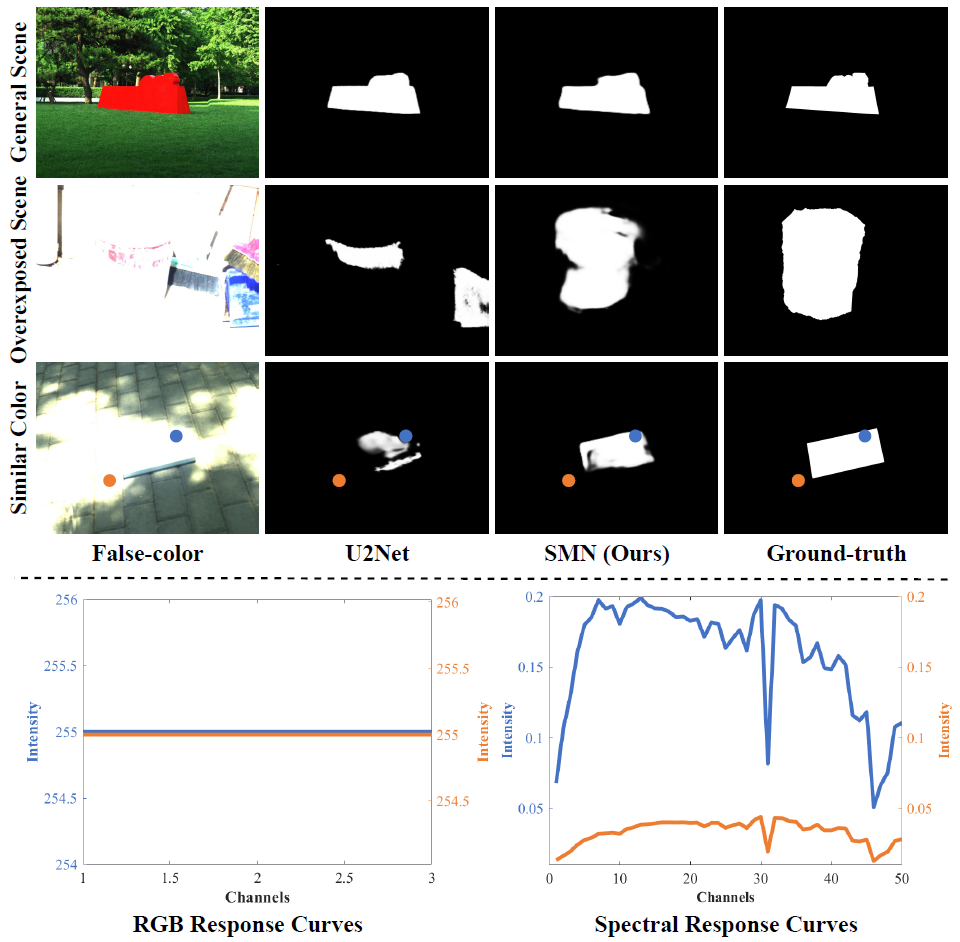

# [SMN: Spectrum-driven Mixed-frequency Network](https://ieeexplore.ieee.org/document/10313066/) [TMM 2023]

by Peifu Liu, Tingfa Xu, Huan Chen, Shiyun Zhou, Haolin Qin, Jianan Li.

[](https://arxiv.org/abs/2312.01060)

## TODO
- [ ] HSOD-BIT dataset and checkpoints
- [ ] Pretrained weight

## Introduction

Hyperspectral salient object detection (HSOD) aims to detect spectrally salient objects in hyperspectral images (HSIs).
However, existing methods inadequately utilize spectral information by either converting HSIs into false-color images or
converging neural networks with clustering. We propose a novel approach that fully leverages the spectral
characteristics by extracting two distinct frequency components from the spectrum: low-frequency Spectral Saliency and
high-frequency Spectral Edge. The Spectral Saliency approximates the region of salient objects, while the Spectral Edge
captures edge information of salient objects. These two complementary components, crucial for HSOD, are derived by
computing from the inter-layer spectral angular distance of the Gaussian pyramid and the intra-neighborhood spectral
angular gradients, respectively. To effectively utilize this dual-frequency information, we introduce a novel
lightweight Spectrum-driven Mixed-frequency Network (SMN). SMN incorporates two parameter-free plug-and-play operators,
namely Spectral Saliency Generator and Spectral Edge Operator, to extract the Spectral Saliency and Spectral Edge
components from the input HSI independently. Subsequently, the Mixed-frequency Attention module, comprised of two
frequency-dependent heads, intelligently combines the embedded features of edge and saliency information, resulting in a
mixed-frequency feature representation. Furthermore, a saliency-edge-aware decoder progressively scales up the
mixed-frequency feature while preserving rich detail and saliency information for accurate salient object prediction.
Extensive experiments conducted on the HS-SOD benchmark and our custom dataset HSOD-BIT demonstrate that our SMN
outperforms state-of-the-art methods regarding HSOD performance.

<div align="center">
  
</div>

## Architecture

<div align="center">
  
</div>

## Requirements

Our project utilizes Python version 3.8.13, with PyTorch version 1.12.1 and torchvision version 0.13.1. We also use CUDA
version 11.3. In addition, our project depends on the following libraries:
[NATTEN](https://www.shi-labs.com/natten/), einops, timm, mmcv, h5py, tqdm.

Please ensure you have these libraries installed to properly run our code.

## Checkpoints and Results

Our HSOD-BIT dataset is currently in preparation. Until it's ready, we will not be providing checkpoints and test
results on HSOD-BIT. We are working diligently to complete the dataset preparation and will provide updates here as soon
as it's available.

Checkpoints and test results on the HS-SOD dataset are available for download
from [Google Drive](https://drive.google.com/drive/folders/1HWVb-HEYtwzH5VRNcW5wrQOrVvauCcAo?usp=sharing)
or [Baidu Drive (gc81)](https://pan.baidu.com/s/1HnFzJ720TzJL704FKaPf5Q).

## Getting Started

### Data Preparation

Please download the HS-SOD dataset from [https://github.com/gistairc/HS-SOD](https://github.com/gistairc/HS-SOD). After
downloading, divide the dataset into training and testing sets and place them in the `./DataStorage/HS-SOD/` directory.
The ground truth images of the edges are generated using [pidinet](https://github.com/hellozhuo/pidinet). Please place
them in the `edge_GT/` folder.

If you want to use our checkpoints directly, please download the checkpoints from the link above and place them in
the `checkpoints/` folder.

The structure of the `DataStorage/` should be as follows:

```
|DataStorage/
    |--- HSOD-BIT/
    |--- HS-SOD/
        |--- test.txt
        |--- train.txt
        |--- checkpoints/
            |--- pvt_v2_b1/
                |--- model-best
            |--- resnet18/
                |--- model-best
            |--- swin_t/
                |--- model-best
        |--- GT/
            |--- train/
                |--- 0001.jpg
                |--- 0003.jpg
                |--- ...
            |--- test/
                |--- 0002.jpg
                |--- 0009.jpg
                |--- ...
        |--- hyperspectral/
            |--- train/
                |--- 0001.mat
                |--- 0003.mat
                |--- ...
            |--- test/
                |--- 0002.mat
                |--- 0009.mat
                |--- ...
        |--- color/
            |--- train/
                |--- 0001.jpg
                |--- 0003.jpg
                |--- ...
            |--- test/
                |--- 0002.jpg
                |--- 0009.jpg
                |--- ...
        |--- edge_GT/
            |--- 0001.jpg
            |--- 0003.jpg
            |--- ...
```

### Testing

To test our model, please unsure that the checkpoints are placed in the `checkpoints/` folder. Then,
run the following command (take the PVT_v2_b1 backbone as an example):

``` shell
CUDA_VISIBLE_DEVICES="0" python test.py --backbone="pvt_v2_b1" --model_path="DataStorage/HS-SOD/checkpoints/pvt_v2_b1/model-best" --data_path="DataStorage/HS-SOD" --dataset="HS-SOD"
```

### Training

To train our model, execute the `HSOD_run.sh` script. This script handles the training process automatically. Model
checkpoints will be stored in the `checkpoints/` directory. After training, the script will proceed to test the model
and save the results in the `exp_results/` folder. An automatic evaluation of the model will follow the testing phase.

``` shell
sh HSOD_run.sh
```

**Please Note**: Due to the large size of HSIs, frequent reading can lead to slow training speed. Our approach involves
loading HSIs once. The extraction of Spectral Edge and Spectral Saliency is integrated into the DataLoader, and the
results are stored in memory. This significantly reduces runtime without substantially increasing memory usage.

## BibTeX

```
@ARTICLE{10313066,
  author={Liu, Peifu and Xu, Tingfa and Chen, Huan and Zhou, Shiyun and Qin, Haolin and Li, Jianan},
  journal={IEEE Transactions on Multimedia}, 
  title={Spectrum-driven Mixed-frequency Network for Hyperspectral Salient Object Detection}, 
  year={2023},
  volume={},
  number={},
  pages={1-15},
  doi={10.1109/TMM.2023.3331196}}
```

## Acknowledgement

Our implementation is mainly based on the following codebases. We gratefully thank the authors for their wonderful
works.

[NATTEN](https://github.com/SHI-Labs/NATTEN), [ITTI-saliency-detection](https://github.com/Samaretas/ITTI-saliency-detection), [Evaluate-SOD](https://github.com/Hanqer/Evaluate-SOD)

## License

This project is released under the [MIT license](LICENSE).
